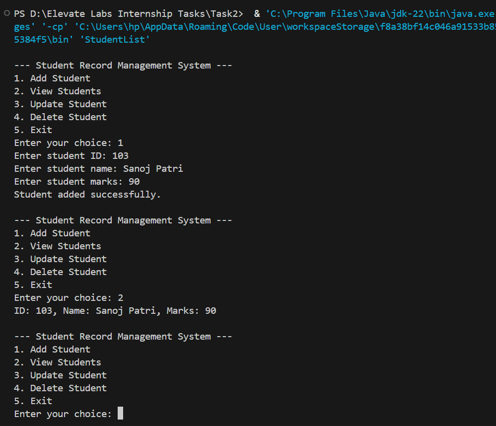

# Student Record Management System (Java Console App)

This project is submitted as part of the Java Developer Internship - Task 2 (Elevate Labs).



## 💡 Objective
Create a CRUD system to manage student records using Java Classes, Collections, and basic console I/O.

## 🛠 Tech Stack
- Java (JDK)
- VS Code / IntelliJ
- Command Prompt / Terminal

## 📂 Features
- Add new student record
- View all student records
- Update student record by ID
- Delete student record by ID
- Menu-driven console interaction

## 👨‍🏫 Concepts Used
- Classes and Objects
- Encapsulation (private variables + public methods)
- ArrayList collection
- Loops, Conditionals, and Switch-case
- Scanner for user input

## 🚀 How to Run

1. Clone or download this repository.
2. Compile the code:
```

javac StudentList.java

```
3. Run the program:
```

java StudentList

```

## 🔍 Sample Menu
```

\--- Student Record Management System ---

1. Add Student
2. View Students
3. Update Student
4. Delete Student
5. Exit

```

## 📁 Files Included
- StudentList.java - Main Java file with code
- Interview_Question_Answers.txt - Questions & answers related to this task
